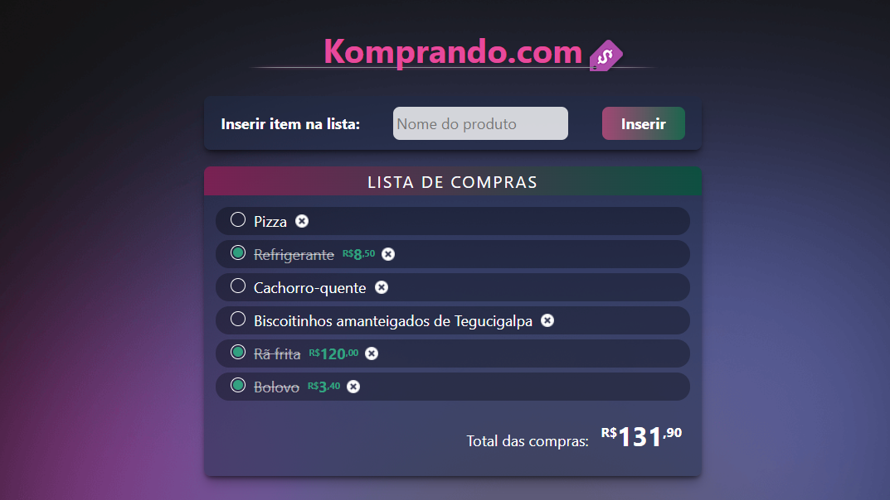
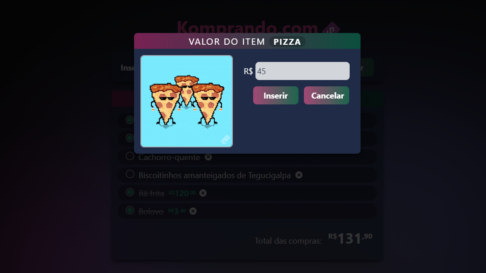

# Komprando.com - aplicativo de lista de compras

## Briefing

Você está participando de um processo seletivo para ingressar em uma vaga de programador em uma grande empresa de TI. Uma das etapas do processo envolve a criação de uma aplicação web para controle e cálculo de uma lista de compras.

## Conhecimentos praticados

* **HTML:** principais tags como head, meta, title, body, div, h1, form, input, button, ul, li. Atributos de tags como class, id, type. Inclusão de arquivos de estilos (css) e de script (js) na página.

* **CSS:** estilizar a página, os botões, inputs, alterar atributos dos elementos da tela de acordo com a interação do usuário para uma melhor experiência do usuário (UX).

* **Javascript:** variáveis, arrays, funções, manipulação do DOM (eventos, elementos e seus atributos), manipular objetos (JSON), utilizar o localStorage.

## Checklist de requisitos

- [x] Título
- [x] Ícone de favorito
- [x] Cabeçalho
- [x] Campo para digitação de novos produtos
- [x] Botão para cadastrar produtos na lista
- [x] Exibição de lista de produtos cadastrados
- [x] Checkbox para selecionar itens e riscá-los
- [x] Exibir numa lista o texto digitado
- [x] Realizar o cálculo total de compras
- [x] Salvar a lista no LocalStorage a cada alteração
- [x] Carregar a lista do LocalStorage ao abrir a página
- [x] Fazer a estilização visual da página
- [x] Código Javascript em arquivo separado
- [x] Exibição de gif dinâmico na página

## Screenshots

### Tela principal



### Pop-up de cadastro de preço



## Amostra de código

Há algumas coisas interessantes no código Javascript, como a constante MODO_DEBUG. Ao ser ajustada para true, ela ativa várias saídas no console que ajudam a depurar em tempo de execução.

```
function mostraPopupPreco() {
	inputPopupPrecoItem.value = arrayLista[liAtual.id].preco;

	if (inputPopupPrecoItem.value == 0) {
		inputPopupPrecoItem.value = "";
	}
	
	// mostra na popup o nome do item atual
	const popupNomeItem = document.querySelector("#popupNomeItem");
	popupNomeItem.innerText = arrayLista[liAtual.id].nome;

	// insere dentro da popup o gif obtido via API
	obtemGif(arrayLista[liAtual.id].nome);
	
	screenMask.style.display = "block"; // mostra camada abaixo da popup mascarando toda a tela
	popupDiv.style.display = "block"; // mostra a popup
	inputPopupPrecoItem.select();

	if(MODO_DEBUG) { console.log("Função\t\t> mostraPopupPreco()"); }
}
```

## Debriefing

|Tarefa|Software|Tempo|
|---|---|---|
|Codificação HTML, CSS e JS|[VS Code](https://code.visualstudio.com/)|16h|
|Criação de cabeçalho|[Photoshop](https://www.adobe.com/br/products/photoshop/)|1h|
|Testes|[Chrome](https://google.com/chrome) e [Firefox](https://www.mozilla.org/firefox)|4h|

## Créditos

- DEVinHouse 2022 - Turma Audaces
- Módulo 1 - Projeto Avaliativo 1
- Aluno: Bruno Castro
